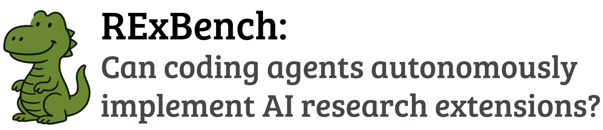

# rexbench-harbor

<div align="center">

<!-- # RExBench : Can coding agents autonomously implement AI research extensions? -->


**Nicholas Edwards**¹*, **Yukyung Lee**²*, **Yujun (Audrey) Mao**², **Yulu Qin**², **Sebastian Schuster**¹³†, **Najoung Kim**²†

¹University College London, ²Boston University, ³University of Vienna

*, † Equal contribution

[Paper](https://arxiv.org/abs/2506.22598) | [Website](https://rexbench.com/) | [Dataset 🤗](https://huggingface.co/datasets/tin-lab/RExBench)

</div>

## 🔎 Overview

This repository provides the code and scripts for running 2 tasks from the RExBench adapter in Harbor using the original benchmark setup.

### 🌐 Interested in the full benchmark or planning to submit?
Check the RExBench website and paper linked above. They cover the full 12-task benchmark, submission details, and the broader evaluation setup beyond this local subset.

This repository supports:
- setting up local task assets and a Python eval environment
- building per-task Docker images
- running an OpenHands-based agent against task repos
- executing saved agent patches inside the task Docker environments
- aggregating success rates from generated evaluation outputs

Both tasks involve resource-intensive execution (e.g., training and evaluating ML models), and require access to an A100 40G GPU. Tasks may take multiple hours to finish (oracle verification for `cogs`: ~2.5 hours; oracle verification for `othello`: ~45 minutes).

**Supported tasks**
- `cogs`
- `othello`

## ✅ Requirements

For reproducibility, the following machine configuration is required:
- **GPU:** 1x NVIDIA A100 (40GB VRAM) per trial (`n_concurrent_trials: 1` recommended)
- **OS:** Ubuntu 24.04
- **NVIDIA driver:** 535 series
- **NVIDIA Container Toolkit CLI:** 1.18.2
- **Disk Space:** Ensure sufficient disk space for Docker images (10-20GB for each task environment), and ~200MB for datasets/models in the `othello` task (downloaded at patch execution time in `run_docker.sh`).
- Python 3 with `venv` support (`python3 -m venv`)
- An Anthropic API key for agent runs (`ANTHROPIC_KEY`)

## 🗂️ Repository Layout

```text
rexbench-harbor/
├── tasks.zip                # zipped base task repos
├── patches.zip              # zipped oracle patches
├── tasks/                   # extracted task repos
├── patches/                 # extracted oracle patches
├── images/                  # per-task Dockerfiles
├── eval_scripts/            # per-task eval scripts
├── repos/                   # temporary working copies used by run_agent.sh
├── evaluation/              # exported per-run result artifacts and logs consumed by calculate_success_rates.py
├── evaluation_results/      # aggregated JSON success-rate summaries
└── scripts/                 # orchestration scripts (setup/run/eval)
```

## 🧪 Running Experiments
### 1. Setup
Run the setup script once after cloning:

```bash
bash scripts/setup_eval.sh
```

This script:
- extracts `tasks.zip` into `tasks/` if needed
- extracts `patches.zip` into `patches/` if needed
- copies `tasks/cogs` into `images/cogs/base_repo`
- copies `tasks/othello` into `images/othello/base_repo`
- creates `.venv/` for evaluation
- installs Python packages from `requirements-eval.txt`

Activate the environment when running eval scripts directly:

```bash
source .venv/bin/activate
```

### 2. Build Docker Images
After setup, build the task images from the repo root using the following commands:

```bash
docker build -t cogs_image:latest -f images/cogs/Dockerfile images/cogs
docker build -t othello_image:latest -f images/othello/Dockerfile images/othello
```

**Note:** Each task Docker image is large (~10-20 GB) and initial builds may take up to 30 minutes.

#### API Keys

For agent runs, export your Anthropic key:

```bash
export ANTHROPIC_KEY=your_key_here
```

`run_agent.sh` maps this into `LLM_API_KEY` inside the OpenHands container command.

### 3. Run Agent
Run an agent trial from the repo root:

```bash
bash scripts/run_agent.sh <repo_name> <task_name> <run_number>
```

Examples:

```bash
bash scripts/run_agent.sh cogs cogs 1
bash scripts/run_agent.sh othello othello 1
```

The current agent runner installs and uses OpenHands `openhands-ai==1.4.0` inside the container. This matches the OpenHands version used for parity-style local runs in this repo, using the default CodeActAgent.

What it does:
- copies `tasks/<repo_name>/` into a temporary working repo under `repos/<repo_name>/`
- runs the agent in the OpenHands container against that working copy
- captures a patch of the agent's code edits relative to the base repository
- saves the trajectory JSON and patch under `patches/<agent_name>/<task>/default/`
- deletes the temporary working copy

### 4. Execute an Agent Patch
To run a saved agent patch inside the task Docker environment and export the relevant result artifacts into `evaluation/`, execute:

```bash
bash scripts/execute_patch.sh <agent_name> <task_name> <run_number>
```

Examples:

```bash
bash scripts/execute_patch.sh openhands_claude_4.5_sonnet cogs 1
bash scripts/execute_patch.sh openhands_claude_4.5_sonnet othello 1
```

By default, it looks for patches under:

```text
patches/<agent>/<task>/default/<agent>_default_runN.patch
```

If your patches live somewhere else, pass a custom patch root as the 4th argument:

```bash
bash scripts/execute_patch.sh openhands_claude_4.5_sonnet cogs 1 /custom/patch/root
```

The script:
- creates a temporary working copy of `tasks/<task>/`
- creates `evaluation/<agent>/<task>/default/runN/`
- applies the patch inside the container
- runs `eval_scripts/<task>/run_docker.sh`
- exports only the required result artifacts plus the execution log into `evaluation/<agent>/<task>/default/runN/`
- enforces a 12-hour host-side timeout for the container run - this replicates our original benchmark setup, where verification runtime was capped to 12 hours, which is around twice the duration of the oracle solution with the longest runtime among all our extension tasks

### 5. Aggregate Evaluation Results
Once per-run result artifacts exist under `evaluation/<agent>/...`, aggregate success rates with:

```bash
bash scripts/run_eval.sh <agent_name> [result_dir]
```

Example:

```bash
bash scripts/run_eval.sh openhands_claude_4.5_sonnet results
```

This runs `scripts/calculate_success_rates.py`, which:
- reads the exported result artifacts from `evaluation/<agent>/<task>/default/runN/`
- writes an output JSON to `evaluation_results/<agent>/<result_dir>/`

You can also call it directly:

```bash
source .venv/bin/activate
python3 scripts/calculate_success_rates.py openhands_claude_4.5_sonnet results
```

## 📈 Parity and Local Results

This repo currently contains a two-task subset (`cogs`, `othello`) being released in Harbor, but the setup follows the same overall execution flow used in the Harbor adapter parity experiments for all 12 tasks.

- For parity-style local runs here, the agent configuration is OpenHands `openhands-ai==1.4.0` (using default CodeActAgent) with `anthropic/claude-sonnet-4-5`, matching the configuration installed in `scripts/run_agent.sh`.
- On the full benchmark, the original RExBench reference reported a Final Success Rate of `33.33% ± 0.00%` for OpenHands with `anthropic/claude-sonnet-4-5` over all 12 tasks and 3 trials.
- The code solutions were not identical (expected for long-form, high-variance ML tasks), but performance was identical across implementations.
- This follows the observed variation of repeatedly running the same agent 5 times, as done in Edwards et al. (2025).

- For the released two-task subset in this repo, the parity results are:

| Task | Success Rate | Successful Runs |
|------|--------------|------|
| `cogs` | `66.67%` | `2/3` |
| `othello` | `100.00%` | `3/3` |

## ▶️ Typical End-to-End Flow

```bash
# Setup
bash scripts/setup_eval.sh

# Build Docker Images
docker build -t cogs_image:latest -f images/cogs/Dockerfile images/cogs
docker build -t othello_image:latest -f images/othello/Dockerfile images/othello

# Run Agent
export ANTHROPIC_KEY=your_key_here
bash scripts/run_agent.sh cogs cogs 1

# Execute Agent Patch
bash scripts/execute_patch.sh openhands_claude_4.5_sonnet cogs 1

# Aggregate Evaluation Results
source .venv/bin/activate
bash scripts/run_eval.sh openhands_claude_4.5_sonnet results
```

## 📝 Notes
- 🚀 This repo is optimized for local, reproducible runs of the two released tasks rather than the full public benchmark packaging flow.
- **Tasks require GPUs:** Since the tasks involve training and evaluating ML models, GPU machines are required. To guarantee results replication, a single A100 40GB GPU should be used with the setup detailed in [Requirements](#requirements).
- **Images are 10-20GB:** Since the environments rely on CUDA dependencies, per-task Docker images are large (~10–20 GB) and initial builds may take up to 30 minutes. Ensure you have sufficient space on your system before starting to run tasks.
- **Task execution can take multiple hours:** The longest running oracle solution takes around 2.5 hours to complete (with additional time required for building the Docker environment). Note that agent solutions may take even longer to run in some cases. To account for this, we limit the verification runtime to 12 hours, which is around twice the duration of the oracle solution with the longest runtime among our extension tasks in the original benchmark.

## 📚 Citation

```bibtex
@article{rexbench2025,
      title={RExBench: Can coding agents autonomously implement AI research extensions?},
      author={Edwards, Nicholas and Lee, Yukyung and Mao, Yujun (Audrey) and Qin, Yulu and Schuster, Sebastian and Kim, Najoung},
      journal={arXiv preprint},
      year={2025},
      url={https://arxiv.org/abs/2506.22598}
}
```

## 👋 Contact
- Nicholas Edwards (original RExBench author and maintainer of this repository), GitHub: `@nedwards99`
- Team RExBench (rexbench@googlegroups.com)
